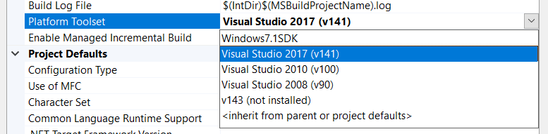
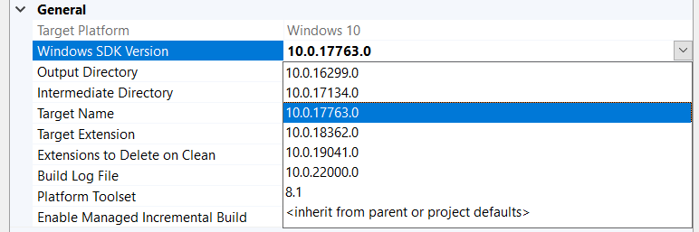
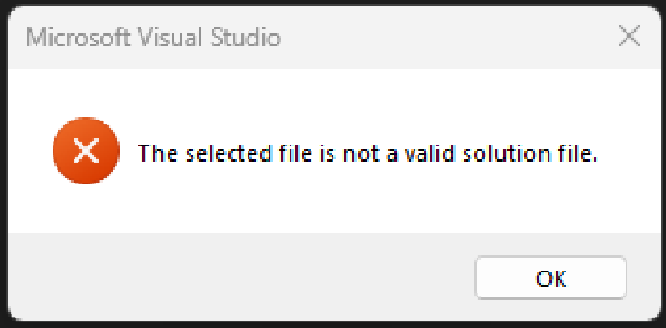
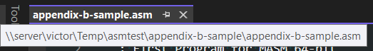
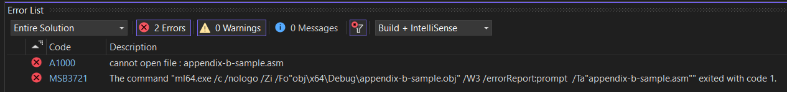
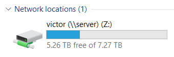
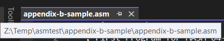

# Common Visual Studio Problems

If you are having trouble building example solutions or assignments with Visual Studio, check out some of the common problems and solutions listed below.

## Missing C++ Toolset

If Visual Studio is unable to open a project and you see a dialog telling you to "Install Missing Features", you need to install the C++ development toolset using the Visual Studio Installer ([screenshot](screenshots/missing-cpp-tools.png)).

## Different Visual Studio Versions

The example projects are configured to use Visual Studio 2022 and the Windows 10 SDK. If you are using a different version of Visual Studio (for example, some computer labs have 2017 installed), you may need to reconfigure a project before it will work.

### Platform Toolset

- Open the solution in Visual Studio.
- Right-click on a project in the Solution Explorer and click `Properties` ([screenshot](screenshots/opening-project-properties.png)).
- Go to the `General` properties section (first section in the list) ([screenshot](screenshots/general-project-properties.png)).
- Change the `Platform Toolset` property to the version you have installed.

### Windows SDK Version

Visual Studio 2017 also seems to prefer an explicit Windows SDK version. Pick one of the `10.0.x` versions that are installed on the machine using the `Windows SDK Version` property on the same page. The specific version does not matter.

## Invalid File or Read-Only Errors

You may see an error that says something like "The selected file is not a valid solution file" or you may see something indicating Visual Studio is working in a read-only mode.

This can be caused by trying to open a solution within a ZIP archive file without extracting the contents of the archive first.

Right-click on the ZIP file in Windows Explorer and choose `Extract All...` to extract the contents of the archive. Then try to open the Visual Studio solution that was extracted.

## Running on Network Share

You may encounter issues running a project that is stored on a network share.

In this case, you must mount the network share as a drive or move the repository to a local disk.

