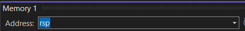

# Visual Studio Memory Window

The memory debug window can be a useful tool. It allows you to inspect values in memory.

## Opening the Window

- Set a breakpoint in your program.
- Debug the program until the breakpoint is hit.
- While the program is paused at the breakpoint, open the `Debug` menu from the top menu bar. Then choose `Windows` -> `Memory` -> `Memory 1` (Visual Studio allows multiple memory windows to be opened).

## Inspecting Data

Enter a memory address in the address bar of the memory window, then press the enter key.


If you have a variable defined in your program, you can enter the name of the variable prefixed with an `&` to get the address of that variable.

For example, assume you have the following variable defined in your assembly source file:

```
.DATA
    var1 QWORD 110
```

You could enter `&var1` into the memory debug window's address bar and press the enter key to view that address in memory. After you press enter, Visual Studio will translate the correct memory address and update the address bar for you.


If you have a pointer variable (a variable that stores a memory address itself) you could just enter the variable name without the `&`. Visual Studio evaluates the value stored in the variable and uses that as the memory address to view.

If you have a register with a memory address, you can enter the name of the register in the address bar for a similar result.



## Watch Window

Another useful tool is the "watch" window. Right-click on a variable in your assembly source code and choose `Add Watch`.


This will add a watch for that variable in the watch window. You can see the current value of the variable and watch it change as the program executes.


