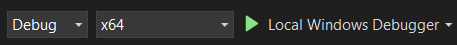
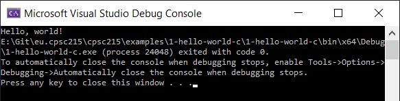
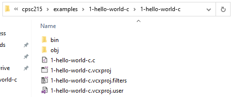
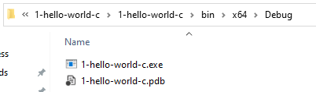
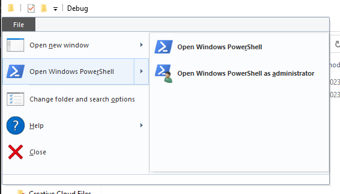

# Hello World - C

This is a simple program written in the C programming language along with a Visual Studio solution and project to build it.

## Build and Run

To build and run the program, open the `1-hello-world-c.sln` file. This is the Visual Studio solution file. A solution file can contain multiple projects, but for this solution we only have one project. Refer to [this](../../docs/visual-studio-issues.md) document if you have trouble opening or building projects with Visual Studio.

Once the solution is loaded in Visual Studio, there are multiple ways to build and run the project. One way is to just click the `Local Windows Debugger` button in the top toolbar:

Clicking this button should build and run the program. The program is very simple. It will print the text `Hello, world!` to the console, then exit. The console should remain open after the program exits so you can see the output of the program:

## Output Directory

You can find the output executable that was generated by the build process in the file explorer. Navigate to the project directory in the file explorer. It should look something like this:

The `bin` directory contains the generate output. Navigate into the `bin\x64\Debug` directory and you will see the generated executable file along.

You should see two files in this directory:

- `1-hello-world-c.exe` is the executable program file
- `1-hello-world-c.pdb` is a debugging symbol file used by Visual Studio when debugging the program.

You can also run the program outside of Visual Studio just like any other program. If you double click the executable file in the file explorer, the program will executable. However, the program will run and then immediately close the console window, so it will be impossible to see the program output.

To work around this, you can open a console window manually and run the program from there. There are multiple ways to do this (Command Prompt, PowerShell, Windows Terminal, etc.). Pick your favorite command line program, navigate to the output directory containing the executable file, and execute the program.

Here's an example of how to do this using PowerShell: with the file explorer window opened to the output directory containing the executable file, click the `File` button in the top left corner and choose `Open Windows PowerShell`.

In the PowerShell window, type `./1-hello-world-c.exe` and press enter. The output of the program should be displayed.
