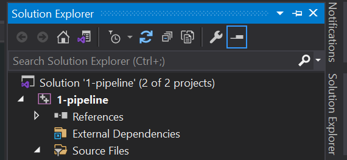
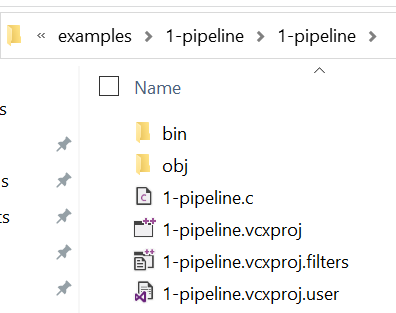
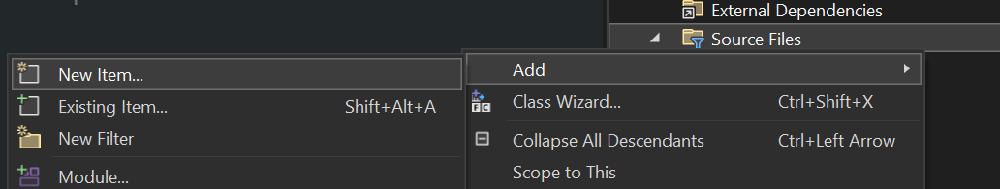
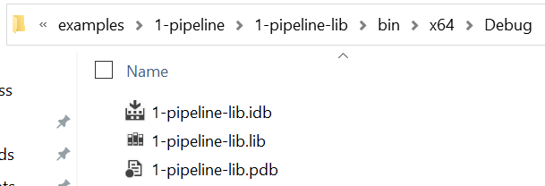
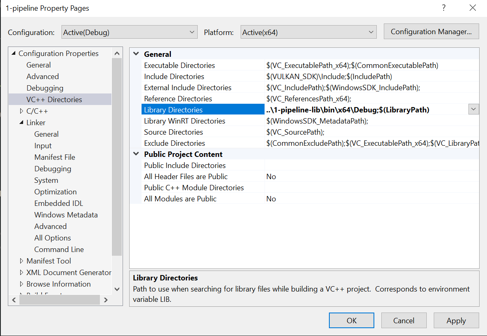
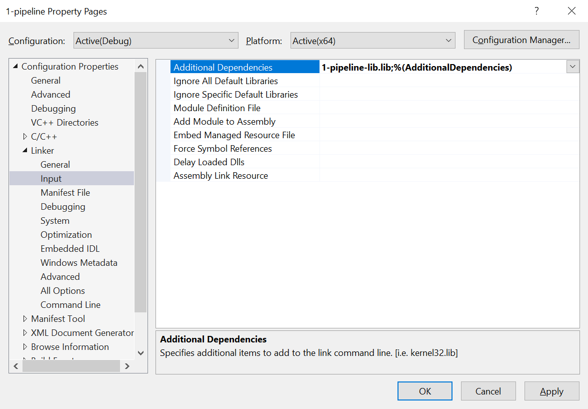

# Translation Pipeline

This example illustrates the different parts of the translation pipeline using the C programming language and Microsoft's Visual C/C++ compiler (MSVC).

## First Look

Start by opening the `1-pipeline.sln` solution in Visual Studio. Refer to [this](../../docs/visual-studio-issues.md) document if you have trouble opening or building projects with Visual Studio.

There are two projects in this solution. We'll start with `1-pipeline`. Find this project in the Solution Explorer. If you can't find the Solution Explorer, click `View` -> `Solution Explorer` from the top menu.

[](./screenshots/solution-explorer.png)

This project is a very simple C program. Building the project will generate an exectuable application file.

Build the project by right-clicking on it and then choosing `Build`.

Navigate to the project directory in Windows Explorer. If you can't find the project directory, you can right-click the project in the Solution Explorer and choose `Open Folder in File Explorer`.

The build process will generate two folders:
- `obj` - contains the intermediate build files. This includes assembly files, object files, and any additional files Visual Studio generates to help with the build process.
- `bin` - contains the final executable.

[](./screenshots/bin-obj.png)

## Generating Assembly Output

If you poke around the intermediate build files in the `obj` folder, you'll notice there aren't any assembly files. Why not?

The compiler being used (MSVC) does not generate assembly code by default; it skips straight to machine code. Let's tell the compiler to generate assembly output.

Right-click on the project in the Solution Explorer, then choose `Properties`. In the project properties dialog, go to the `C/C++` section, then `Output Files`. Find the `Assembler Output` option in the properties list. You can change this setting to control what kind of output the assembler will generate.

Change the setting to `Assembly, Machine Code and Source (/FAcs)` and rebuild the project. You'll now see a `1-pipeline.cod` file included in the intermediate output files. This is a code listing file that includes the high-level source code interleaved with the assembly and machine code the compiler generated. You can open the file in a text editor to inspect it.

As you inspect the code listing, observe the one-to-many relationship of the high-level statements to machine instructions and constrast that with the one-to-one relationship of the assembly statements to machine instructions.

Take the following snippet from the code listing as an example:

```
; 14   :     int val = add(2, 3);

0001b    ba 03 00 00 00    mov   edx, 3
00020    b9 02 00 00 00    mov   ecx, 2
00025    e8 00 00 00 00    call  add
0002a    89 45 04          mov   DWORD PTR val$[rbp], eax
```

The first line is the high-level C statement. The `14` indicates this is from line 14 of the source file. The C code is then listed.

The remaining lines are the machine and assembly instructions.

Take the first line for example:

```
0001b    ba 03 00 00 00    mov   edx, 3
```

- `0001b` is the offset (in hexadecimal) of this instruction within the current function.

- `ba 03 00 00 00` is sequence of bytes that make up the machine instruction. Again, this is presented in hexadecimal format rather than binary.

- `mov   edx, 3` is the assembly instruction.

In this case, the compiler generated four machine instructions and four assembly instructions for one high-level C statement.

## Adding Another Source File

Open the original source file, `1-pipeline.c`. At the top of the file, add the following function declaration:

```
int subtract(int a, int b);
```

Update the `main` function to call `subtract` instead of `add`:

```
int main()
{
    int val = subtract(2, 3);
    return val;
}
```

Try to build the project. You should receive an error like this:

```
Error LNK2019 unresolved external symbol subtract referenced in function main
```

We declared a function named `subtract` and tried to call it. The linker tried to find the definition of the function, but could not find it, resulting in a linker error.

Let's fix the error by providing the definition of the function.

Find the `1-pipeline` project in the Solution Explorer. Right-click on the `Source Files` filter and add a new item.



Name the new file `subtract.c`. Add the following function to the new file:

```
int subtract(int a, int b)
{
    return a - b;
}
```

Build the project. It should succeed. Go to the intermediate output directory again within the `obj` folder. You'll notice there are now two `.obj` files: one for each source file in the project. There will also be two code listing files or assembly listing files, depending on the assembler output setting.

## Using a Static Library

A static library is a file containing compiled code that can be included and used in other projects. When a project using a static library is compiled, the library code is copied and embedded into the new executable.

To distribute a static library, two files are provided: the static library itself (`.lib`) containing the compiled code, and a header file (`.h`) providing declarations of functions available in the library. A consumer of the library includes the header file in whatever source files it wants to use the library in, and informs their linker where to find the library file.

Find the `1-pipeline-lib` project in the Visual Studio Solution Explorer and build it. This project generates a static library, not an executable. Go to the `bin` output directory for this project. You should see the `1-pipeline-lib.lib` file. This is the static library generated by the project.

[](./screenshots/static-lib-output.png)

Let's have the `1-pipeline` project consume the static library we just build.

Open the `1-pipeline.c` file and add the following line to the top of the file:

```
#include "../1-pipeline-lib/1-pipeline-lib.h"
```

This header file includes the declaration for the function provided by the static library. The library provides a single function, `multiply`.

Update the `main` function in `1-pipeline.c` to call the `multiply` function:

```
int main()
{
    int val = multiply(2, 3);
    return val;
}
```

Build the `1-pipeline` project. You should see the following error:

```
Error LNK2019 unresolved external symbol multiply referenced in function main
```

Just as before, this indiates the linker cannot locate the `multiply` function. We need to tell the linker to include our static library that contains the definition of this function.

Right-click the `1-pipeline` project in the Solution Explorer and click `Properties`. Open the `VC++ Directories` section. Find the `Library Directories` setting in the list and change the value to:

```
..\1-pipeline-lib\bin\x64\Debug;$(LibraryPath)
```

[](./screenshots/lib-dir-setting.png)

This tells the linker what directory to search for static libraries in, but it doesn't tell it what library we want to use.

Go to the `Linker` -> `Input` section of the properties window. Find the `Additional Dependencies` setting and change the value to:

```
1-pipeline-lib.lib;%(AdditionalDependencies)
```

[](./screenshots/additional-deps.png)

Click `OK` to close the properties dialog and apply the changes.

Now build the `1-pipeline` project again. It should succeed this time. You can run the executable and observe the output.

## Visual Studio Output Verbosity

When building a project in Visual Studio, the output window displays information about the steps being taken. By default, a lot of details are hidden - in most cases it's not important. However, if you are curious about what commands are being executed, you can adjust the output verbosity.

From the top menu in Visual Studio, choose `Tools` -> `Options`. Go to the `Projects and Solutions` -> `Build and Run` section of the options dialog. Find the setting `MSBuild project build output verbosity`. You can change this experiment with this setting to see additional details in the output window when you build projects.
