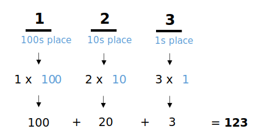
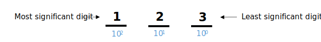
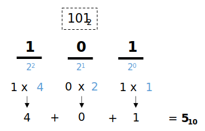
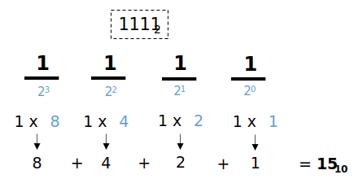
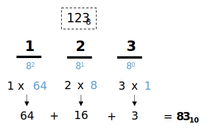
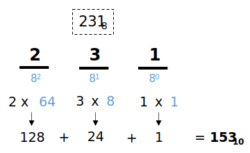
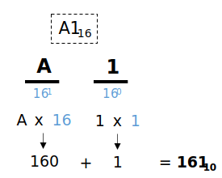
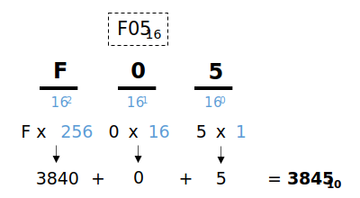

# 1.2 - Number Systems

Recommended reading:

- Hall & Slonka, pp. 8-12

## Overview

Numbers play a fundamental role in the operation of computers. The instructions a computer executes, as well as any data used by those instructions, must be represented as numbers. We'll start by looking at numbers as an abstract concept, then we'll look at how data is encoded into numbers.

A single number can be represented in one of many number systems. We'll look at four common number systems:

| Name | Base | # of digits | Digits |
| ---- | ---- | ----------- | ------ |
| Binary | Base 2 | 2 | `0` - `1` |
| Octal | Base 8 | 8 | `0` - `7` |
| Decimal | Base 10 | 10 | `0` - `9` |
| Hexadecimal (Hex) | Base 16 | 16 | `0` - `9`, `A` - `F` |

## Decimal (Base 10)

The decimal number system is what we are most familiar with. Let's start by looking at the number `123`.

A number is comprised of one or more digits, organized into places. You may recall learning about "place value" back in elementary school. Each place contains one digit; that digit is scaled by a certain factor depending on the place.



How do we know how much to scale each digit by? Use the formula B<sup>n</sup>.
- _B_ is the number system _base_ (or _radix_). This is the number of unique digits available to choose from in the number system. The base 10 number system has 10 unique digits: `0`, `1`, `2`, ... `9`.
- _n_ starts at zero for the least significant digit and increases by one for each additional place.



The concept of _most-significant digit_ and _least-significant digit_ is important to note. The least-significant digit has the least influence on the overall value of the number. In the example above, changing the digit in the ones place from `3` to `4` only changes the value of the number by one. But changing the hundreds place from `1` to `2` increases the value of the number by 100. Thus, it has more significance.

Let's summarize the decimal number system:

- Base: 10
- Available digits: `0` through `9`

You can indicate the base of a number with a subscript like 123<sub>10</sub> or (123)<sub>10</sub> or 123<sub>ten</sub>.

## Binary (Base 2)

- Base: 2
- Available digits: `0` and `1`
- A digit in the binary number system is often referred to as a _binary digit_, or _bit_. The _most-significant bit_ is the same thing as the most-significant digit.

The table below shows a sample mapping of decimal numbers to binary.

<table>
  <tr>
    <th>Decimal</th>
    <td>0</td>
    <td>1</td>
    <td>2</td>
    <td>3</td>
    <td>4</td>
    <td>...</td>
  </tr>
  <tr>
    <th>Binary</th>
    <td>0</td>
    <td>1</td>
    <td>10</td>
    <td>11</td>
    <td>100</td>
    <td>...</td>
  </tr>
</table>

### Converting Binary to Decimal

We can demonstrate converting a number from binary to decimal using the same principles we learned when looking at the decimal number system.

_Example:_ Convert 101<sub>2</sub> to base 10



_Example:_ Convert 1111<sub>2</sub> to base 10



### Converting Decimal to Binary

Here is a method to convert a number from decimal to binary:
- Divide by 2.
- Save remainder.
- Divide quotient by 2.
- Save remainder.
- Repeat until quotient is 0.
- Take the remainder values to construct the final binary number.

_Example:_ Convert 52<sub>10</sub> to base 2

```
52 / 2 = 26  R 0 (LSB)
26 / 2 = 13  R 0
13 / 2 = 6   R 1
6  / 2 = 3   R 0
3  / 2 = 1   R 1
1  / 2 = 0   R 1 (MSB)

Answer: 110100
```

Notice the first remainder is the least-significant bit and the last remainder is the most-significant bit.

_Example:_ Convert 123<sub>10</sub> to base 2

```
123 / 2 = 61  R 1 (LSB)
61  / 2 = 30  R 1
30  / 2 = 15  R 0
15  / 2 = 7   R 1
7   / 2 = 3   R 1
3   / 2 = 1   R 1
1   / 2 = 0   R 1 (MSB)

Answer: 1111011
```

## Octal (Base 8)

- Base: 8
- Available digits: `0` through `7`

The table below shows a sample mapping of decimal numbers to octal.

<table>
  <tr>
    <th>Decimal</th>
    <td>0</td>
    <td>1</td>
    <td>...</td>
    <td>7</td>
    <td>8</td>
    <td>9</td>
    <td>...</td>
  </tr>
  <tr>
    <th>Octal</th>
    <td>0</td>
    <td>1</td>
    <td>...</td>
    <td>7</td>
    <td>10</td>
    <td>11</td>
    <td>...</td>
  </tr>
</table>

### Converting Octal to Decimal

_Example:_ Convert 123<sub>8</sub> to base 10



_Example:_ Convert 231<sub>8</sub> to base 10



### Converting Decimal to Octal

The process for converting decimal to octal is the same as binary, but divide 8 instead of 2.

_Example:_ Convert 52<sub>10</sub> to base 8

```
52 / 8 = 6  R 4 (LSD)
6  / 8 = 0  R 6 (MSD)

Answer: 64
```

_Example:_ Convert 123<sub>10</sub> to base 8

```
123 / 8 = 15  R 3 (LSD)
15  / 8 = 1   R 7
7   / 8 = 0   R 1 (MSD)

Answer: 173
```

## Hexadecimal (Base 16)

- Base: 16
- Available digits: `0` through `9`, `A` through `F`

Hexadecimal uses 16 unique digits. The letters `A` through `F` serve as the additional six digits after `0` through `9`. The table below shows a sample mapping of decimal numbers to hexadecimal.

<table>
  <tr>
    <th>Decimal</th>
    <td>0</td>
    <td>1</td>
    <td>...</td>
    <td>9</td>
    <td>10</td>
    <td>11</td>
    <td>12</td>
    <td>13</td>
    <td>14</td>
    <td>15</td>
    <td>16</td>
    <td>17</td>
    <td>18</td>
    <td>...</td>
  </tr>
  <tr>
    <th>Hex</th>
    <td>0</td>
    <td>1</td>
    <td>...</td>
    <td>9</td>
    <td>A</td>
    <td>B</td>
    <td>C</td>
    <td>D</td>
    <td>E</td>
    <td>F</td>
    <td>10</td>
    <td>11</td>
    <td>12</td>
    <td>...</td>
  </tr>
</table>

### Converting Hex to Decimal

_Example:_ Convert A1<sub>16</sub> to base 10



_Example:_ Convert F05<sub>16</sub> to base 10



### Converting Hex to Binary

Hex has a convenient property where one hex digit is comprised of exactly four binary digits. This helps when converting hex to binary and vice versa. For example, A1<sub>16</sub> is equal to 10100001<sub>2</sub>.

```
 A      1      (base 16)
1010   0001    (base 2)
```

Remember that each hex digit must have exactly four binary digits associated with it. In the example above, the hex digit `1` is equal to the binary value `1`, but we must include three leading zeros, otherwise the value of the final number is incorrect.

When writing or displaying numeric values, we usually omit any leading zeros from the entire number. For example, 3C<sub>16</sub> is equal to 00111100<sub>2</sub>. If we are just concerned about the binary number value, we can omit the leading zeros since they have no impact on the overall value: 111100<sub>2</sub>.

Later we'll talk about binary numbers in the context of bits and bytes, where we have a fixed amount of bits available. We'll see that omitting leading zeros can cause problems in certain scenarios (i.e., when working with signed integers).

### Converting Hex to Binary to Octal

Octal has a convenient property where one octal digit is comprised of exactly three binary digits. This lets us convert between hex, decimal, and octal efficiently.

_Example:_ Convert A1<sub>16</sub> directly to binary, then to base 8.

```
 A      1       (base 16)
1010   0001     (base 2)

010  100  001   (base 2)    <-- Binary number re-written in groups of three bits
 2    4    1    (base 8)
```

In this example, the conversion from hex to binary was the same as before: each hex digit is converted into its appropriate set of four binary digits. The binary value is then re-written into groups of three bits. **It's important to start the grouping with the least-significant bits first.** Notice that an additional 0 was added to the front of the binary value for padding to demonstrate the correct grouping of bits.

### Notes on Hex

Hexadecimal has convenient properties which makes it very useful. Check out https://medium.com/@savas/why-do-we-use-hexadecimal-d6d80b56f026.

## Binary Addition

Binary addition will be important when we start talking about signed integers. Binary addition works just like decimal addition (except...in binary).

_Example:_ 0101<sub>2</sub> + 0111<sub>2</sub> = ?

1. Start by writing the problem:

```
  0101
+ 0111
------

```

2. Add the least significant digits, `1 + 1`. This equals `2` in decimal, but we're dealing with binary, so the value is `10`. Write the `0` digit in the result line and carry the `1`. This leaves us with:

```
    1   <--- carry the 1
  0101
+ 0111
------
     0  <--- 0 goes to the result line
```

3. Add the next column of digits. Since we carried a one, there are three digits to add: `1 + 0 + 1`. Same as before, this equals `2` in decimal, but `10` in binary.

```
   11   <--- carry the 1
  0101
+ 0111
------
    00  <--- 0 goes to the result line
```

4. Add the next column of digits, `1 + 1 + 1`. The result is `3` in decimal, but `11` in binary.

```
  111   <--- carry the 1
  0101
+ 0111
------
   100  <--- 1 goes to the result line
```

5. Add the final column of digits, `1 + 0 + 0`. This is an easy one, since there is no carrying to be done. Just drop the `1` down into the result.

```
  111
  0101
+ 0111
------
  1100  <--- 1 goes to the result line
```

The final answer is 0101<sub>2</sub> + 0111<sub>2</sub> = 1100<sub>2</sub>

You may find this Khan Academy video on binary addition helpful: https://www.youtube.com/watch?v=RgklPQ8rbkg