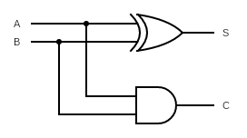
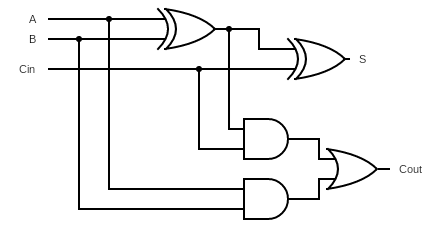

# 1.4 - Boolean Logic

Recommended reading:

- Hall & Slonka, pp. 16-17

## Boolean Operations

| a | b | a AND b | a OR b | a XOR b | a NAND b | a NOR b |
| :-: | :-: | :-: | :-: | :-: | :-: | :-: |
| 0 | 0 | 0 | 0 | 0 | 1 | 1 |
| 0 | 1 | 0 | 1 | 1 | 1 | 0 |
| 1 | 0 | 0 | 1 | 1 | 1 | 0 |
| 1 | 1 | 1 | 1 | 0 | 0 | 1 |

| a | NOT a |
| :-: | :-: |
| 0 | 1 |
| 1 | 0 |

## Digital Logic

Half adder

Full adder

Additional references:

- Ben Eater's 8-bit CPU video series: https://eater.net/8bit/
  - YouTube channel: https://www.youtube.com/@BenEater
- Logic gates: https://en.wikipedia.org/wiki/Logic_gate
- Transistors: https://en.wikipedia.org/wiki/Transistor
- Half and full adder: https://en.wikipedia.org/wiki/Adder_(electronics)
- Example 4-bit adder integrated circuit: https://www.ti.com/product/SN74LS283
- SR latch: https://en.wikipedia.org/wiki/Flip-flop_(electronics)
