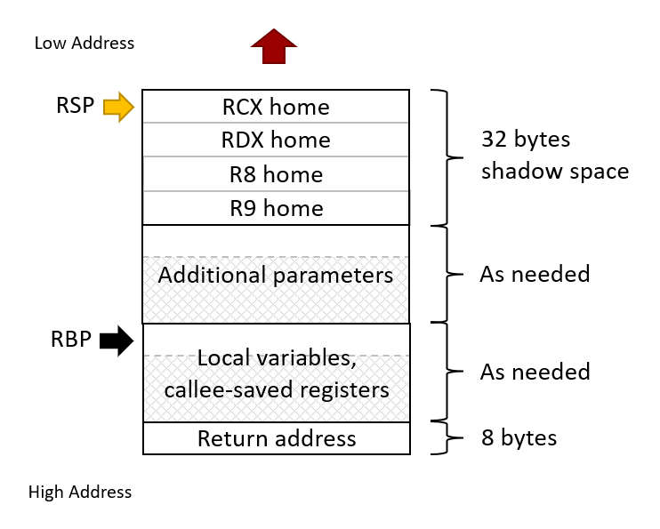

# x64 ABI Cheatsheet

This serves as a cheatsheet for the basics of the x64 ABI calling convention. Refer to the the textbook (chapter 6) and lecture materials for detailed descriptions.

## Function Prologue

1. Save callee-saved registers that will be used.
2. Reserve stack space for local variables.
3. Establish frame pointer (RBP): `mov rbp, rsp`
4. Reserve space for additional parameters for function calls.
5. Ensure 16-byte stack alignment.
6. Reserve 32-byte shadow space for function calls.

## Function Epilogue

1. Cleanup reserved stack space.
2. Restore callee-saved registers.
3. Return.

## Integer Parameters

First four parameters passed in registers:
- `RCX`
- `RDX`
- `R8`
- `R9`

Any additional parameters passed on stack:
- `[rsp + 20h]`
- `[rsp + 28h]`
- `[rsp + 30h]`
- etc.

## Return Values

The `RAX` register is used to store the return value of a fuction.

## Register Ownership

- Caller-saved registers: `RAX`, `RCX`, `RDX`, `R8`-`R11`
- Callee-saved registers: `RBX`, `RSI`, `RDI`, `RBP`, `R12`-`R15`

See [this](https://learn.microsoft.com/en-us/cpp/build/x64-software-conventions?view=msvc-170#register-volatility-and-preservation) document for a full list of how each register is used.

## Stack Usage

See [this](https://learn.microsoft.com/en-us/cpp/build/stack-usage?view=msvc-170) document for full details on stack usage.

# References

- https://learn.microsoft.com/en-us/cpp/build/x64-software-conventions?view=msvc-170
- https://github.com/MicrosoftDocs/cpp-docs/blob/main/docs/build/x64-software-conventions.md
